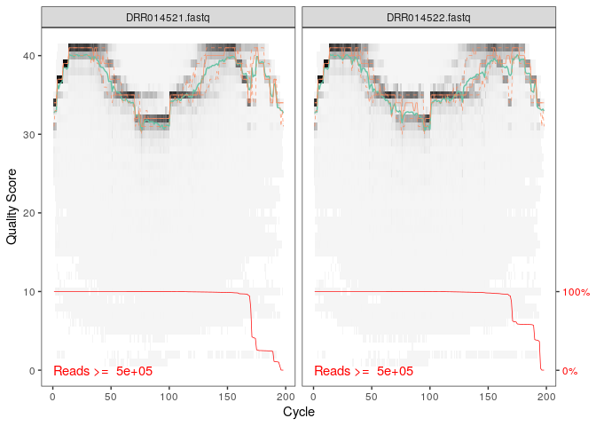
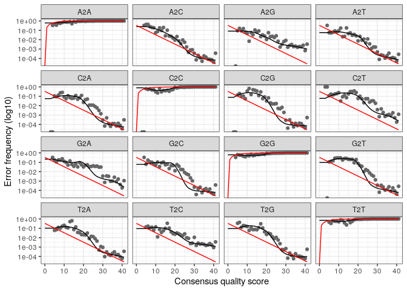
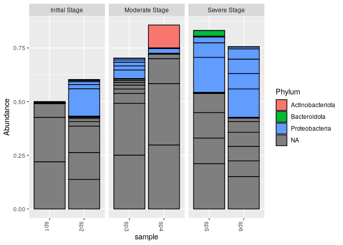
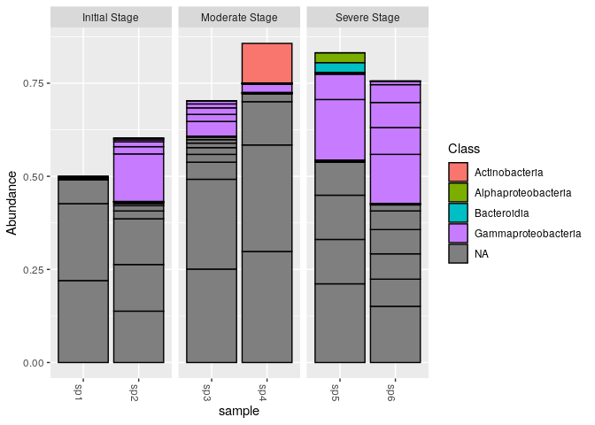
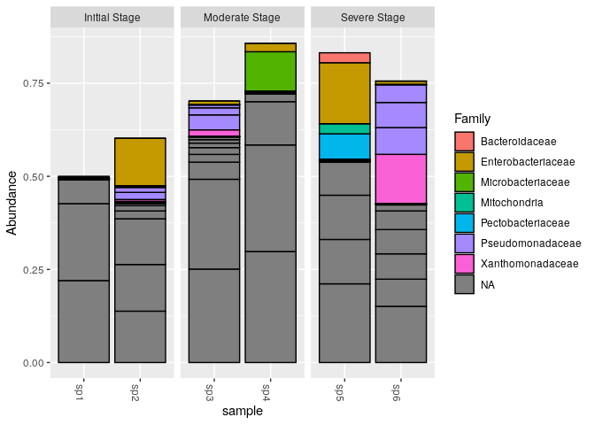
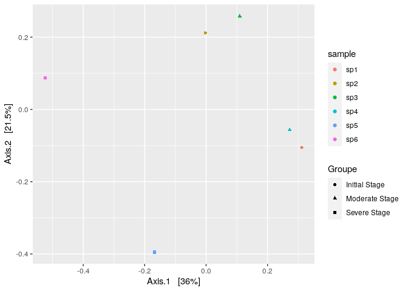
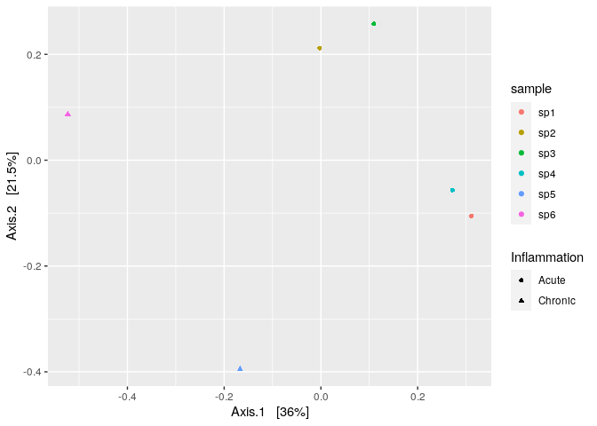

cc3\_Ecog2\_2021/EL KHATI Hamza et TOUZI Saad
================

  - [Introduction:](#introduction)
  - [Filtrer et découper](#filtrer-et-découper)
      - [Obtention des listes des fichiers fastq sens et anti-sens (fnFs
        et
        FnRs)](#obtention-des-listes-des-fichiers-fastq-sens-et-anti-sens-fnfs-et-fnrs)
      - [plots de qualité pour fnFs et
        fnRs](#plots-de-qualité-pour-fnfs-et-fnrs)
      - [modèle d’erreur](#modèle-derreur)
  - [Construire une table de
    séquence](#construire-une-table-de-séquence)
  - [Attribuer une taxonomie](#attribuer-une-taxonomie)
  - [Combine data into a phyloseq
    object](#combine-data-into-a-phyloseq-object)
  - [creation de l’objet phyloseq](#creation-de-lobjet-phyloseq)
  - [Analyse de données et des
    figures](#analyse-de-données-et-des-figures)

Réaliser par: -EL KHATI Hamza -TOUZI Saad

# Introduction:

Dans ce travail l’analyse des données métagénomiques issues de l’article
scientifique « Characterization of bacterial community shift in human
Ulcerative Colitis patients revealed by Illumina based 16S rRNA gene
amplicon sequencing » a été réalisée. Le but est de voir comment varie
les différentes communautés bactériennes du microbiote intestinal des
patients souffrants de colite ulcéreuse suivant le stade de la maladie
(Initial, intermédiaire ou avancé). Pour cela les métadonnées de 6
échantillons de microbiote intestinale de patients malades ont été
analysés en utilisant DADA2 et Phyloseq sur Rstudio. Il faut noter que
sur les auteurs de l’article ont opté pour QIIME pour leur propre
analyse.

``` r
library("rmarkdown")
library("knitr")
```

\#téléchegement des library nésessaires pour analyser les données de ce
papier

``` r
library(dada2)
library(ggplot2)
library(gridExtra)
library(phyloseq)
library(DECIPHER)
library(phangorn)
library(Biostrings)
library(phyloseq)
```

\#directory de notre jeu de données

``` r
miseq_path <- "~/CC3_ecog/E" # CHANGE ME to the directory containing the fastq files after unzipping.
list.files(miseq_path)
```

    ## [1] "DRR014521.fastq" "DRR014522.fastq" "DRR014523.fastq" "DRR014524.fastq"
    ## [5] "DRR014525.fastq" "DRR014526.fastq" "filtered"

# Filtrer et découper

## Obtention des listes des fichiers fastq sens et anti-sens (fnFs et FnRs)

vu que notre jeu de données télécharger ne sont pas séparer (R1 et R2),
nous avons considérer les données comme forwards (fnfs), l’étape de
mergers sera supprimé.

``` r
fnRs <- sort(list.files(miseq_path, pattern=".fastq", full.names = TRUE))
sample.names <- sapply(strsplit(basename(fnRs), "_"), `[`, 1)
sample.names
```

    ## [1] "DRR014521.fastq" "DRR014522.fastq" "DRR014523.fastq" "DRR014524.fastq"
    ## [5] "DRR014525.fastq" "DRR014526.fastq"

## plots de qualité pour fnFs et fnRs

``` r
plotQualityProfile(fnRs[1:2])
```

<!-- -->

``` r
filtRs <- file.path(miseq_path, "filtered", paste0(sample.names, "_R_filt.fastq.gz"))
names(filtRs) <- sample.names
```

\#ici on a tronquer les lectures à la position 170 car les lectures
(forwards) maintiennent une qualité élevée tout au long avec une
dimunition de score de qualités.

``` r
out <- filterAndTrim(fnRs, filtRs, truncLen=(170), maxN=0, maxEE=(2), 
                     truncQ=2, rm.phix=TRUE,
              compress=TRUE, multithread=TRUE) # On Windows set multithread=FALSE
head(out)
```

    ##                 reads.in reads.out
    ## DRR014521.fastq  1113157    855735
    ## DRR014522.fastq  1297214   1109861
    ## DRR014523.fastq  1351828   1112825
    ## DRR014524.fastq  1265118   1086862
    ## DRR014525.fastq  2131276   1994891
    ## DRR014526.fastq   798603    738287

``` r
derepRs <- derepFastq(filtRs, verbose=TRUE)
```

    ## Dereplicating sequence entries in Fastq file: ~/CC3_ecog/E/filtered/DRR014521.fastq_R_filt.fastq.gz

    ## Encountered 66312 unique sequences from 855735 total sequences read.

    ## Dereplicating sequence entries in Fastq file: ~/CC3_ecog/E/filtered/DRR014522.fastq_R_filt.fastq.gz

    ## .Encountered 73732 unique sequences from 1109861 total sequences read.
    ## Dereplicating sequence entries in Fastq file: ~/CC3_ecog/E/filtered/DRR014523.fastq_R_filt.fastq.gz
    ## .Encountered 80532 unique sequences from 1112825 total sequences read.
    ## Dereplicating sequence entries in Fastq file: ~/CC3_ecog/E/filtered/DRR014524.fastq_R_filt.fastq.gz
    ## .Encountered 59906 unique sequences from 1086862 total sequences read.
    ## Dereplicating sequence entries in Fastq file: ~/CC3_ecog/E/filtered/DRR014525.fastq_R_filt.fastq.gz
    ## .Encountered 70179 unique sequences from 1994891 total sequences read.
    ## Dereplicating sequence entries in Fastq file: ~/CC3_ecog/E/filtered/DRR014526.fastq_R_filt.fastq.gz
    ## Encountered 40741 unique sequences from 738287 total sequences read.

``` r
# Name the derep-class objects by the sample names
names(derepRs) <- sample.names
```

## modèle d’erreur

``` r
errR <- learnErrors(filtRs, multithread=TRUE)
```

    ## 145474950 total bases in 855735 reads from 1 samples will be used for learning the error rates.

``` r
plotErrors(errR, nominalQ=TRUE)
```

    ## Warning: Transformation introduced infinite values in continuous y-axis
    
    ## Warning: Transformation introduced infinite values in continuous y-axis

<!-- --> \#
Inférence d’échantillon

``` r
dadaRs <- dada(derepRs, err=errR, multithread=TRUE)
```

    ## Sample 1 - 855735 reads in 66312 unique sequences.
    ## Sample 2 - 1109861 reads in 73732 unique sequences.
    ## Sample 3 - 1112825 reads in 80532 unique sequences.
    ## Sample 4 - 1086862 reads in 59906 unique sequences.
    ## Sample 5 - 1994891 reads in 70179 unique sequences.
    ## Sample 6 - 738287 reads in 40741 unique sequences.

# Construire une table de séquence

cette étape est fait en se basant sur l’étape de le tableau dadaRs

``` r
seqtabAll <- makeSequenceTable(dadaRs[!grepl("Mock", names(dadaRs))])
table(nchar(getSequences(seqtabAll)))
```

    ## 
    ##  170 
    ## 4605

``` r
seqtabNoC <- removeBimeraDenovo(seqtabAll)
```

# Attribuer une taxonomie

Pour faire l’assignation taxonomique, il faut une base de données de
référence. Pour ce faire on utilise un algorithme d’assignation
taxonomique, on va utiliser Silva 138 (01\_data\_import),la méthode de
Blast qui va etre utiliser et le résultat d’une assignation taxonomique
c’est une classification hétérogène avec des séquences qui vont
s’arrêter au genre, à la classe, à la famille ou même au phylum.

``` r
taxa <- assignTaxonomy(seqtabNoC, "~/cc2_Ecog2_hamza/silva_nr99_v138_train_set.fa.gz", multithread=TRUE)
```

Avec un autre jeu de données pour l’assignation taxonomique, on peut
essayer de voir s’il y a 100% de similarité avec d’autres séquences pour
avoir des résultats jusqu’à l’espèce. Avec la commande précédente, on ne
va que jusqu’au genre. On va donc ajouter les espèces dans le tableau
taxa (01\_data\_import).

``` r
taxa <- addSpecies(taxa, "~/cc2_Ecog2_hamza/silva_species_assignment_v138.fa.gz")
```

taxa.print prend la table taxa et enlève les noms de lignes de la table
taxa.print par ce que ce sont les séquences.

``` r
taxa.print <- taxa # Removing sequence rownames for display only
rownames(taxa.print) <- NULL
head(taxa.print)
```

    ##      Kingdom     Phylum           Class                 Order             
    ## [1,] "Bacteria"  NA               NA                    NA                
    ## [2,] "Eukaryota" NA               NA                    NA                
    ## [3,] "Bacteria"  NA               NA                    NA                
    ## [4,] "Bacteria"  "Proteobacteria" "Gammaproteobacteria" "Enterobacterales"
    ## [5,] "Bacteria"  NA               NA                    NA                
    ## [6,] "Bacteria"  "Proteobacteria" "Gammaproteobacteria" "Enterobacterales"
    ##      Family               Genus                  Species
    ## [1,] NA                   NA                     NA     
    ## [2,] NA                   NA                     NA     
    ## [3,] NA                   NA                     NA     
    ## [4,] "Enterobacteriaceae" "Escherichia-Shigella" NA     
    ## [5,] NA                   NA                     NA     
    ## [6,] "Pectobacteriaceae"  "Pectobacterium"       NA

# Combine data into a phyloseq object

write.csv(samdf,“samdf.csv”) c’est une commande pour crée un tableau csv
de notre jeu de données, en suite on va l’importer a travers la commande
suivantes.

``` r
samdf <-read.table('~/CC3_ecog/samdf.csv', sep=',', header=TRUE, row.names=1)
```

# creation de l’objet phyloseq

``` r
ps <- phyloseq(otu_table(seqtabNoC, taxa_are_rows=FALSE), 
               sample_data(samdf), 
               tax_table(taxa))
ps
```

    ## phyloseq-class experiment-level object
    ## otu_table()   OTU Table:         [ 3267 taxa and 6 samples ]
    ## sample_data() Sample Data:       [ 6 samples by 7 sample variables ]
    ## tax_table()   Taxonomy Table:    [ 3267 taxa by 7 taxonomic ranks ]

ggsave est une commande pour save les ggplots se formes (jpg,png,etc.)

``` r
ggsave("plot5.jpg", width=140, height=150,units = "mm")
```

    ## Warning: Transformation introduced infinite values in continuous y-axis
    
    ## Warning: Transformation introduced infinite values in continuous y-axis

# Analyse de données et des figures

``` r
top20 <- names(sort(taxa_sums(ps), decreasing=TRUE))[1:20]
ps.top20 <- transform_sample_counts(ps, function(OTU) OTU/sum(OTU))
ps.top20 <- prune_taxa(top20, ps.top20)
plot_bar(ps.top20, x="sample", fill="Phylum") + facet_wrap(~Groupe, scales="free_x")
```

<!-- --> En
comparant les abondances relatives au niveau du phylum entre les
différents patients. Le phylum des protéobactéries était le plus
abondant. Ce résultat était le même que celui retrouvé par les auteurs
de l’article. Cependant on peut bien remarquer que ce phylum était plus
présent chez les patients souffrant d’un stade avancé de la maladie par
rapport aux patients du stade initial ce qui veut dire que l’avancée de
la maladie était accompagnée par une dysbiose du microbiote intestinal.

``` r
top20 <- names(sort(taxa_sums(ps), decreasing=TRUE))[1:20]
ps.top20 <- transform_sample_counts(ps, function(OTU) OTU/sum(OTU))
ps.top20 <- prune_taxa(top20, ps.top20)
plot_bar(ps.top20, x="sample", fill="Class") + facet_wrap(~Groupe, scales="free_x")
```

<!-- --> Au
niveau des classes, on peut remarquer que le taux de gamaprotéobactéries
augmentait entre le stade initial et le stade avancé. En effet plus la
maladie s’aggrave plus cela s’accompagne avec une augmentation de ces
gammaprotéobactéries montrant encore une fois la dysbiose du microbiote
au stade sévère de la maladie. Ce résultat a aussi été trouvé par les
auteurs de l’article, sauf qu’ils l’ont schématisé de façon à ne voir
que les gammaprotéobactéries, au contraire de notre analyse qui permet
d’avoir une vue d’ensemble montrant les autres classes.

``` r
top20 <- names(sort(taxa_sums(ps), decreasing=TRUE))[1:20]
ps.top20 <- transform_sample_counts(ps, function(OTU) OTU/sum(OTU))
ps.top20 <- prune_taxa(top20, ps.top20)
plot_bar(ps.top20, x="sample", fill="Family") + facet_wrap(~Groupe, scales="free_x")                 
```

<!-- --> Une
troisième analyse a été réalisée au niveau des familles bactériennes. Ce
qu’on peut remarquer à partir de la figure est que les deux familles des
Pseudomonadaceae et des Xanthomonadaceae ont augmenté chez les patients
souffrant du stade avancé de la maladie par rapport aux patients du
stade initial. On remarque aussi que ces deux familles sont les plus
abondantes chez les patients du stade avancé. Bien que ce résultat a
également été trouvé par les auteurs de l’article, il n’a pas été pris
en compte puisqu’il n’était pas statistiquement significatif (P value \>
0.05).

\#ici et vu qu’on a pas le phy\_tree on a utilisé la distance bray au
lieu de unifrac utilisé dans l’article.

``` r
pslog <- transform_sample_counts(ps, function(x) log(1 + x))
out.wuf.log <- ordinate(pslog, method = "PCoA", distance = "bray")
```

``` r
evals1 <- out.wuf.log$values$Eigenvalues
plot_ordination(pslog, out.wuf.log, color = "sample", shape="Groupe") +
  labs(col = "sample",shape= "Groupe")
```

<!-- -->

``` r
evals2 <- out.wuf.log$values$Eigenvalues
plot_ordination(pslog, out.wuf.log, color = "sample", shape="Inflammation") +
  labs(col = "sample",shape= "Inflammation")
```

<!-- -->

Ces figures représentent les deux PCoA réalisées dans notre analyse. Ces
deux PCoA ont été réalisées en utilisant l’indice de Bray curtis. Les
auteurs de l’article ont plutôt utilisé Unifrac Pondéré et Non pondéré
pour construire leur PCoA. Dans notre cas cela n’a pas été possible car
pour utilisé Unifrac, il fallait construire l’arble phylogénétique,
puisque cet indice compare les séquences en prenant en compte la
distance phylogénétique.

La différence entre les deux figures, c’est que celle de droite
représente la PCoA en fonction des échantillons par groupe de patients,
et celle de gauche représente la PCoA plutôt en fonction du stade
d’inflammation (Chronique ou aigue). D’après l’analyse des figures on
remarque que les communautés bactériennes des patients avec le stade
intermédiaire et le stade initial de la maladie sont plus proches les
unes des autres, et sont très éloignées des communautés bactériennes des
patients avec un stade avancé de la maladie. Cela pourrait bien être
expliqué par le statut d’inflammation.

En effet les patients avec stade initial et stade intermédiaire sont
toujours au stade aigue de la maladie, tandis que les patients avec le
stade chronique sont déjà rentrée dans l’état chronique de la cholique
ulcéreuse. Ces résultats donc suggèrent que les changements de
communauté bactériennes du microbiote intestinal dépondent de l’état
d’inflammation causé par les différents stades de la maladie de colite
ulcéreuse.
